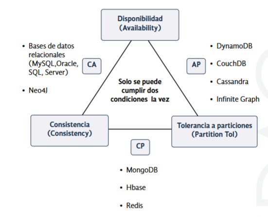

# 📘 Tema 12 — Operaciones con Bases de Datos No-SQL (MongoDB)

## 📑 Índice
- [1. Introducción y contextualización práctica](#1-introducción-y-contextualización-práctica)
- [2. Base de datos MongoDB](#2-base-de-datos-mongodb)
  - [2.1. MongoDB y el teorema de CAP](#21-mongodb-y-el-teorema-de-cap)
  - [2.2. Casos de uso y documentos](#22-casos-de-uso-y-documentos)
- [3. Caso práctico 1: Instalación de MongoDB](#3-caso-práctico-1-instalación-de-mongodb)
- [4. Ficheros binarios de MongoDB](#4-ficheros-binarios-de-mongodb)
- [5. Herramientas](#5-herramientas)
- [6. Shell de MongoDB](#6-shell-de-mongodb)
  - [6.1. Comandos](#61-comandos)
- [7. Operaciones CRUD](#7-operaciones-crud)
- [8. Caso práctico 2: Insertar y borrar](#8-caso-práctico-2-insertar-y-borrar)
- [9. Resumen y resolución del caso práctico](#9-resumen-y-resolución-del-caso-práctico)
- [10. Bibliografía](#10-bibliografía)

---

## 1. Introducción y contextualización práctica

En este tema nos adentramos en el uso práctico de una base de datos **No-SQL**, concretamente **MongoDB**.

### Objetivos
- Entender qué es MongoDB  
- Instalar una base de datos No-SQL  
- Aprender a usar MongoDB  
- Comprender las operaciones **CRUD**

---

## 2. Base de datos MongoDB

MongoDB es una base de datos **No-SQL orientada a documentos** con las siguientes características:

- Documentos en formato **JSON** (internamente BSON)
- Reducción del I/O al evitar *joins*
- Operaciones CRUD con sintaxis similar a JavaScript
- Replicación y alta disponibilidad mediante **Replica Sets**
- Escalado horizontal automático mediante **Sharding**
- Operaciones de agregación para Big Data
- Alto rendimiento (datos en memoria)
- Soporte de **Capped Collections**
- Múltiples motores de almacenamiento
- Forma parte del ecosistema **Big Data**

---

## 2.1. MongoDB y el teorema de CAP

El **teorema de CAP (Brewer)** establece que un sistema distribuido no puede garantizar simultáneamente:

- **Consistencia (C)**: todos los nodos devuelven los mismos datos
- **Disponibilidad (A)**: el sistema siempre responde
- **Tolerancia a particiones (P)**: el sistema sigue funcionando aunque haya fallos de red

### Clasificación de bases de datos
- **AP**: disponibilidad + tolerancia a particiones
- **CP**: consistencia + tolerancia a particiones
- **CA**: consistencia + disponibilidad

📌 **MongoDB se sitúa en el vértice CP**



---

## 2.2. Casos de uso y documentos

### Casos de uso habituales
- CMS y aplicaciones móviles
- Gaming
- E-commerce
- Business Intelligence
- Analítica
- Big Data
- Web caché

### Comparativa Relacional vs MongoDB

| Relacional | MongoDB |
|-----------|--------|
| Base de datos | Base de datos |
| Tabla | Colección |
| Fila | Documento |
| Índice | Índice |
| Insert | Insert |
| Select | Find |
| Update | Update |
| Delete | Remove |

### Documentos
- Cada documento es una entrada en una colección
- Formato clave/valor
- Estructura similar a JSON
- Esquema dinámico (polimorfismo)
- Permite documentos embebidos y arrays
- Escrituras atómicas a nivel de documento

### Ejemplo de documento

```json
{
  "_id": "5457a502e308f720d8999e97",
  "Nombre": "Francisco",
  "Apellidos": "Fernandez Rioja",
  "Edad": 30,
  "Aficiones": {
    "Comics": null,
    "Deportes": ["squash", "natación"]
    },
  "Empresa": "XXXSA",
  "Cargo": "MongoDB DBA",
  "Tecnologias": ["Openstack", "Openshift", "MongoDB"],
  "Proyectos": "{ 
    "Openstack": ["Cliente1","Cliente2"],
    "Openshift": ["Cliente4"]
  }
}
```

---

## 4. Ficheros binarios de MongoDB

- mongod
- mongo
- mongos
- mongodump
- mongorestore

---

## 5. Herramientas

- mongoexport / mongoimport
- mongostat
- mongotop

---

## 6. Shell de MongoDB

```bash
mongo
```

```js
show dbs
use miBD
db.createCollection("holaMundo")
db.holaMundo.insert({ "Nombre": "Ernesto", "Edad": 45 })
db.holaMundo.find()
```
## 6.1. Comandos básicos de la Shell de MongoDB

La siguiente tabla recoge los **comandos más utilizados en la shell de MongoDB**, junto con su descripción y un ejemplo de uso.

| Comando | Descripción | Ejemplo |
|-------|------------|--------|
| `help` | Muestra ayuda general sobre el uso de la shell de MongoDB | `help` |
| `db.help()` | Muestra ayuda sobre los comandos disponibles para la base de datos actual | `db.help()` |
| `db.<coleccion>.help()` | Muestra ayuda sobre los comandos disponibles para una colección concreta | `db.usuarios.help()` |
| `show dbs` | Muestra todas las bases de datos existentes en el servidor | `show dbs` |
| `db` | Devuelve el nombre de la base de datos en la que estamos posicionados | `db` |
| `show collections` | Muestra las colecciones de la base de datos actual | `show collections` |
| `use <db>` | Crea (si no existe) y selecciona una base de datos | `use miBaseDatos` |
| `show users` | Muestra los usuarios definidos en la base de datos actual | `show users` |
| `load("<ruta>")` | Carga y ejecuta un script JavaScript en la sesión actual | `load("script.js")` |
| `it` | Itera sobre los resultados de una consulta cuando hay muchos documentos | `it` |


---

## 7. Operaciones CRUD

| Operación | MongoDB | SQL |
|---------|---------|-----|
| Create | insert | INSERT |
| Read | find | SELECT |
| Update | update | UPDATE |
| Delete | remove | DELETE |

---

## 8. Caso práctico 2: Insertar y borrar

```js
db.equipos.insert({ "Nombre": "RealMadrid", "Camiseta": "blanca", "Ciudad": "Madrid" })
db.equipos.insert({ "Nombre": "FCBarcelona", "Camiseta": "azulgrana", "Ciudad": "Barcelona" })
```

---

## 9. Resumen y resolución del caso práctico

Se han estudiado las operaciones CRUD, la instalación y el uso de MongoDB.

```js
db.Empleados.find({ Edad: { $gt: 40 } })
```

---

## 10. Bibliografía

- https://docs.mongodb.com/
- https://www.paradigmadigital.com/

